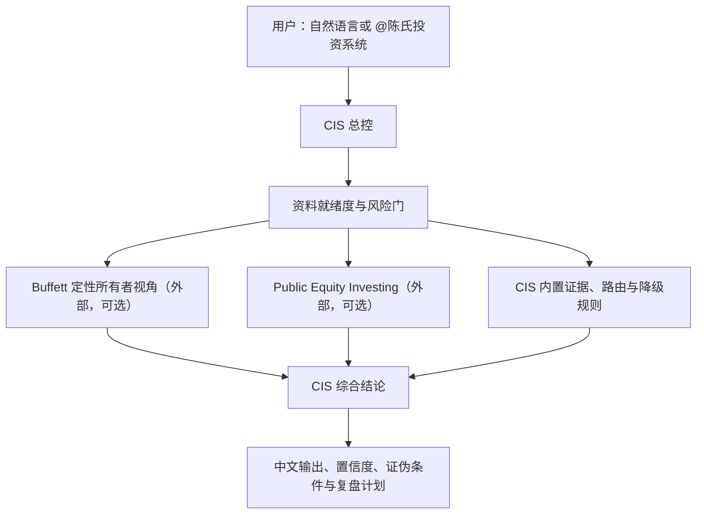

# 陈氏投资系统（Chen Investment System，CIS）

陈氏投资系统是面向中文投资研究的统一总控插件。它把股票、上市公司、ETF、投资组合、财报、估值、宏观、成长、AI 行业、竞争分析与风险研究组织成一条有证据、有边界、可复盘的工作流。

CIS 不承诺自动获得市场数据，也不把任何单一分析框架当作最终决策者。它负责定义问题、检查资料就绪度、选择一个主模块、调度最少数量的支持模块、解释冲突，并形成带资料截止时间、置信度、证伪条件和下一步的中文研究结论。

## 项目形态

本仓库同时是一个可安装的 GitHub repo marketplace：

```text
chen-investment-system/
├─ .agents/plugins/marketplace.json
├─ plugins/chen-investment-system/
│  ├─ .codex-plugin/plugin.json
│  └─ skills/
│     ├─ cis/
│     │  ├─ SKILL.md
│     │  ├─ agents/openai.yaml
│     │  ├─ references/
│     │  └─ scripts/validate_cis.py
│     └─ stock-research-assistant/
│        ├─ SKILL.md
│        └─ agents/openai.yaml
├─ LICENSE
└─ README.md
```

- `cis` 是唯一用户入口和最终研究结论所有者。
- `stock-research-assistant` 只保留为旧中文入口兼容层，并立即转交 CIS。
- Buffett 与 OpenAI Public Equity Investing 是外部专业模块；其源码不包含在本仓库中。

## 架构与模块边界



### Buffett 的定位

Buffett 是 CIS 内置调度逻辑中的“专业定性分析模块/外部依赖”，用于：

- 商业模式和商业质量；
- 护城河及其可持续性；
- 管理层诚信、能力与股东取向；
- 资本配置、所有者收益和长期持有纪律。

Buffett 不是唯一决策者，也不负责审计级财务标准化、实时市场数据或最终目标价。CIS 必须继续汇总财务、估值、业绩、宏观、组合与风险模块，最终结论始终归 CIS。

本项目不复制 `agi-now/buffett-skills` 源码。发布时该上游仓库未提供明确的 LICENSE，故这里只提供[上游依赖链接](https://github.com/agi-now/buffett-skills)和完全原创的适配/降级规则。使用上游项目前，请自行复核其最新许可证与安装说明。本项目与该上游无隶属、合作或背书关系。

### Public Equity Investing 的定位

OpenAI Public Equity Investing 可作为可选增强，承担财务标准化、估值、业绩、宏观传导、ETF/指数、组合风险、情景分析和研究交付物等工作流。本仓库不复制任何 OpenAI bundled/curated plugin 源码。

## 统一研究流程

1. 标准化研究对象、问题、模式、期限和 `as_of`。
2. 读取个人投资规则；未设置项保持 `未设置`。
3. 检查所需模块的能力状态与本次就绪度：`ready`、`limited` 或 `blocked`。
4. 建立证据登记，区分事实、计算、假设和判断。
5. 先运行风险门，再选择一个主模块和最少数量的支持模块。
6. 将模块结果适配为统一返回格式并解释冲突。
7. 生成研究姿态、证伪条件、跟踪指标和下一复盘日期。

详细规则见：

- [系统流程](plugins/chen-investment-system/skills/cis/references/system-workflow.md)
- [模块登记](plugins/chen-investment-system/skills/cis/references/module-registry.md)
- [模块路由](plugins/chen-investment-system/skills/cis/references/module-routing.md)
- [输入输出契约](plugins/chen-investment-system/skills/cis/references/io-contract.md)
- [证据与置信度](plugins/chen-investment-system/skills/cis/references/evidence-confidence.md)

## 安装

### 方式一：GitHub repo marketplace

```bash
git clone https://github.com/chentinghui/chen-investment-system.git
cd chen-investment-system
codex plugin marketplace add .
codex plugin add chen-investment-system@chen-investment-system
```

安装或更新后，请新建一个任务，使新的 Skills 被重新发现。

### 方式二：ChatGPT 桌面端 Work 模式

在支持本地 Codex plugins / repo marketplace 的 ChatGPT 桌面端 Work 环境中：

1. 克隆本仓库。
2. 在 Plugins 或 Marketplace 管理界面添加本仓库根目录；也可在可用终端中执行上面的 `codex plugin marketplace add .`。
3. 安装 `chen-investment-system@chen-investment-system`。
4. 新建 Work 任务，在编辑器中选择 `@陈氏投资系统`，或直接用自然语言调用。

不同桌面版本的菜单名称可能不同；以当前客户端显示为准。如果当前环境不支持本地 repo marketplace，可使用下方 Codex Skill 手动兼容方式。

### 方式三：Codex CLI

使用“方式一”的两条 `codex plugin` 命令。检查结果：

```bash
codex plugin list
```

如果只需要 Skills、而当前 CLI 不支持 plugin marketplace，可将以下两个目录复制到用户 Skills 目录：

```text
plugins/chen-investment-system/skills/cis
plugins/chen-investment-system/skills/stock-research-assistant
```

例如放入 `~/.codex/skills/` 下对应的同名目录。不要复制整个第三方插件缓存。

## 调用示例

在支持插件 mention 的界面中：

```text
@陈氏投资系统 分析腾讯控股，模式用 standard，资料截止到今天。
```

自然语言入口：

```text
用陈氏投资系统分析贵州茅台是否值得进入深入研究。
启动投资总控，比较沪深300 ETF 和中证红利 ETF 的定位、费用、持仓重合与主要风险。
用陈氏投资系统复盘 AAPL 最新财报是否改变了原投资论点。
股票研究助手分析宁德时代。
```

最后一句会进入兼容 Skill，再转交 CIS。

## 标准输入

```text
research_type: company | stock | ETF | portfolio | industry | macro | earnings
subject: 名称及股票/基金代码
research_question: 本次要回答的问题
mode: quick | standard | deep | holding_review
as_of: 价格、财报和市场数据截止时间
horizon: 短期 | 1-3年 | 3-10年
constraints: 市场、流动性、集中度、税务、伦理或其他限制
portfolio_context: 持仓、权重、成本、基准和资金需求
source_posture: 用户资料 | 已连接数据源 | 公开资料 | 混合
evidence_provided: 用户提供的文件、数字、链接或无
```

缺失字段只有在会改变研究路线或结论时才询问。

## 输出约定

每个模块返回 `capability_status`、`runtime_readiness`、资料截止时间、发现、证据、计算、假设、风险、证伪条件、三类置信度、开放问题和下一复盘日期。

没有完整组合背景时，CIS 只使用：

- `进入深入研究`
- `继续观察`
- `暂时回避`
- `证据不足`

只有持仓、权重、成本、基准、约束和资金需求充分时，才使用 `维持`、`考虑增持`、`考虑减持`、`考虑退出` 或 `暂不操作`。这些是研究姿态，不是交易指令。

## 依赖与降级行为

| 能力 | 类型 | 未安装或不可用时 |
|---|---|---|
| CIS | 内置、必需 | 总控、证据登记、风险门和基础研究仍可运行 |
| Buffett | 外部、可选 | 定性所有者模块标记 `limited` 或 `blocked`；CIS 不伪造 Buffett 输出 |
| OpenAI Public Equity Investing | 外部、可选增强 | 对应财务、估值、业绩、宏观、ETF 或组合工作流标记 `limited` / `blocked`，并列出最小缺失能力或数据 |
| 数据连接器 | 外部、按任务 | 不得声称已运行；可以改用用户资料或公开来源，并降低置信度 |

完整降级规则见[外部模块适配](plugins/chen-investment-system/skills/cis/references/external-modules.md)。

## 证据等级与置信度

- **A 级**：监管申报、交易所/基金公司正式资料、经审计财报、官方公告。
- **B 级**：公司投资者资料、业绩发布、管理层原始讲话、权威政府或行业数据。
- **C 级**：可靠市场数据商、主流财经媒体、方法透明的第三方研究。
- **D 级**：聚合页面、二手摘要、社交媒体、未披露方法的估算。

系统分别评估 `Evidence confidence`、`Thesis confidence` 和 `Valuation confidence`。综合置信度不得高于与最终结论最相关的最低等级。

## 当前版本与已知限制

当前版本：`0.1.0`

- 本仓库只包含 CIS 自有总控、规则、验证和旧入口兼容层。
- 不内置行情、财务数据库或付费数据权限。
- 外部插件“已安装”不等于本次研究数据“已就绪”。
- Buffett 上游许可证未明确，故不随仓库分发。
- 不复制 OpenAI 或其他第三方插件源码。
- GitHub 上的公开 repo marketplace 不等于进入 OpenAI universal public Plugins Directory。若希望所有 ChatGPT 用户直接从公共目录安装，还需要按 OpenAI 当期流程另行提交并通过审核。

## 风险声明

本项目用于研究组织、证据核验和分析辅助，不构成投资顾问服务、证券推荐、收益承诺、交易指令、法律或税务意见。市场价格和公司信息会变化；任何结论都必须结合最新资料、个人目标、风险承受能力和独立判断。用户对最终投资决定及其后果自行负责。

## 隐私与安全

仓库不包含 API key、token、邮箱、私密个人账号、会话、记忆、日志、本机配置或机器专属路径；仅在 manifest 中保留公开 GitHub 作者账号。CIS 不会因为插件已安装就假定某个连接器获得授权。

## 许可证与第三方声明

CIS 自有代码和文档采用 [MIT License](LICENSE)。第三方项目、插件、商标和内容不包含在本许可证授权范围内；其权利归各自所有者所有。本项目与 OpenAI、`agi-now/buffett-skills` 及其他外部依赖方无隶属、合作或背书关系。
